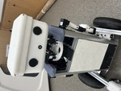

# About me

Hi! I'm <b>Hyungkyu Kim</b>, a <b>Software Engineer</b> of <b>[SMHC株式会社](https://smhc.co.jp/)</b>.  
I'd like to help people who have problems and trust that I can get better every single day!     
If you have any questions, please feel free to reach out through any of the channels listed below this page. 
  

# Experience

## [株式会社テンダ](https://www.tenda.co.jp/) (2024/04/01 ~ 2025/03/31)
- Software Engineer

## [SMHC株式会社](https://smhc.co.jp/) (2025/05/01 ~ Now)
- Software Engineer

  

# Stack
## Programming
### Front Side
HTML , CSS , Javascript , Jquery , React

### Server Side & Database
Python , PHP , Laravel , Java , Spring Boot , MariaDB

### Other
Git , LINUX (REDHat)

### Communication Tool
Slack

  

## Language
<b>Korean</b>
- As a Korean, I have no difficulty in using the Korean language.

<b>Japanese</b>
- I acquired the JLPT N2 certification in December 2022 and am capable of using Japanese at a business level. 
- Moreover, I have experience residing in Japan and working for a company there.

<b>English</b>
- I scored 875 on the TOEIC exam in January 2022 
- And have over 6 months of experience teaching Korean to English-speaking students on the language education platform [Preply](https://preply.com/), dedicating at least 30 hours per week. 
- I am proficient in English at a business level.
  

# Certification

<b>Oracle Java Silver Se8<b>

<b>JLPT N2</b>

# Project
1. [Chat Assistant](https://github.com/HyungkyuKimDev/Chat_Assistant)
    - Stack : Python , NaverCloud , ChatGPT
    - A Chat Assistant for senior. Using Python, Naver Clova, Wake Word and ChatGPT 3.5   
    It can understand what you say on Mic. And answer like a human on Speaker.    
    It can be your friend. And If you want to change ChatGPT's prompt, then you can make other Chat Assistant easily.
  

# Award
1. [2nd place in MJU SEP Fusion Festival, 2021](https://www.mju.ac.kr/eciems/index.do)   
    - Stack : Fusion360, 3D printer , Arduino
    - Smart Compression Bin
        - When people reach their hand near Bin. It opens automatically by ULTRASONIC SENSOR.
            So, People can throw trash without touching that Bin.
            And when the amount of trash in Bin is over the standard that we predetermined by ULTRASONIC SENSOR.
            It compresses itself automatically by linear actuator. Then, we can use the Bin much more usefully.
            And also we can know that amount in web using Wi-Fi module. It can help people who manage Bin can work more efficiently.
    - My team is consisted of 3 members. I'm in charge of Product Design
    - [Youtube Link](https://www.youtube.com/watch?v=JbwHst7UF98&ab_channel=%EA%B9%80%ED%98%95%EA%B7%9C)

  

2. [Silver Award in the Myongji University Capstone Design, 2023](https://www.mju.ac.kr/eciems/index.do)    
    
    - Stack : Python , C , C++ , ROS2: Humble Hawksbill , Ubuntu 22.04 Jammy Jellyfish(Orange Pi Plus) , ChatGPT , Naver CLOUD , Twilio      
    - A Companion robot Myoung-ja for elderly individuals living alone   
        - In the 2023 Myongji University Capstone Design Competition, our team won the Silver Award. The competition focused on products developed with embedded technology, and students from the Electrical Engineering, Electronic Engineering, and Mechanical Engineering departments formed teams.
        - Our team designed a companion robot for the elderly. This robot offers mobility alone or the option to accompany the user on a walk. It can engage in conversations with the user, control movements, and manage battery usage through dialogue. Additionally, it features sensors to detect user falls or potential fires, allowing it to send emergency messages when needed.

    - [Youtube Link](https://youtu.be/FfN0cjAcmhg)
    - [Github Link](https://github.com/MJU-Capstone-PetRobot/mjbot_2023)

# Education
[MYOUNGJI UNIVERSITY, Republic of Korea](https://www.mju.ac.kr/mjukr/index.do) (2017/03/01 ~ 2024/02)
- Degree: Bachelor of Smart Embedded Mechanical System (Double Major in Mechanical Engineering, Electrical Engineering, and Electronic Engineering)   
- GPA: 3.48/4.5
- Relevant Courseworks:
    - Data Structure and Algorith
    - Embedded System
    - MicroProcessor
    - Thermodynamics
    - Solid mechanics
  
