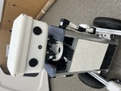

[]

# About Me

こんにちは！私は**Hyungkyu Kim**と申します。**[Tenda(株式会社テンダ)](https://www.tenda.co.jp/)**の**ソフトウェアエンジニア**です。  
問題を抱えている人々を助けることが好きで、毎日少しずつ成長できると信じています。  
何か質問がありましたら、このページの下に記載されているいずれかのチャンネルを通じてお気軽にご連絡ください。

 

# Experience

## [株式会社テンダ](https://www.tenda.co.jp/) (2024/04/01 ~ 2025/03/31)
- ソフトウェアエンジニア

## [SMHC株式会社](https://smhc.co.jp/) (2025/05/01 ~ 現在)
- ソフトウェアエンジニア

 

# Stack
## Programming
### Front Side
HTML , CSS , Javascript , Jquery

### Server Side & Database
Python , PHP , Laravel , Java11 , MariaDB

### Other 
Git , LINUX (REDHat)

### Communication Tool
Slack

 

## 言語

**韓国語**
- 韓国人として、韓国語の使用に問題はありません。

**日本語**
- 2022年12月にJLPT N2を取得し、ビジネスレベルで日本語を使用することができます。
- また、日本に住んで会社で働いた経験があります。

**英語**
- 2022年1月にTOEICで875点を取得しました。
- 言語教育プラットフォーム[Preply](https://preply.com/)で英語を話す学生に週に少なくとも30時間、6か月以上韓国語を教えた経験があります。
- ビジネスレベルで英語を使用することができます。

 

# 資格

<b>Oracle Java Silver SE8</b>
<b>JLPT N2</b>

# プロジェクト

1. [Chat Assistant](https://github.com/HyungkyuKimDev/Chat_Assistant)
    - スタック: Python, NaverCloud, ChatGPT
    - 高齢者向けのチャットアシスタント。Python、Naver Clova、Wake Word、ChatGPT 3.5を使用しています。
    マイクで言ったことを理解し、スピーカーで人間のように答えます。
    友達になれるでしょう。また、ChatGPTのプロンプトを変更したい場合は、簡単に他のチャットアシスタントを作成できます。

 

# 受賞歴

1. [MJU SEP Fusion Festival 2021で2位](https://www.mju.ac.kr/eciems/index.do)
    - スタック: Fusion360、3Dプリンター、Arduino
    - **スマート圧縮ゴミ箱**
        - 人がゴミ箱に手を近づけると、超音波センサーによって自動的に開きます。
        したがって、ゴミ箱に触れることなくゴミを捨てることができます。
        ゴミ箱内のゴミの量が超音波センサーで事前に設定した基準を超えると、
        線形アクチュエータによって自動的に圧縮されます。これにより、ゴミ箱をより効率的に使用できます。
        さらに、Wi-Fiモジュールを使用してウェブ上でゴミの量を監視でき、管理者の効率を向上させます。
    - チームは3人で構成され、私は製品デザインを担当しました。
    - [YouTubeリンク](https://www.youtube.com/watch?v=JbwHst7UF98&ab_channel=%EA%B9%80%ED%98%95%EA%B7%9C)

 

2. [明治大学キャップストーンデザイン2023で銀賞](https://www.mju.ac.kr/eciems/index.do)
    
    - スタック: Python, C, C++, ROS2: Humble Hawksbill, Ubuntu 22.04 Jammy Jellyfish (Orange Pi Plus), ChatGPT, Naver Cloud, Twilio
    - **一人暮らしの高齢者のためのコンパニオンロボット「ミョンジャ」**
        - 2023年の明治大学キャップストーンデザインコンペティションで、私たちのチームは銀賞を受賞しました。このコンペティションは、組み込み技術を用いて開発された製品に焦点を当てており、電気工学、電子工学、機械工学の学生がチームを組んで参加しました。
        - 私たちのチームは、高齢者のためのコンパニオンロボットを設計しました。このロボットは、単独での移動やユーザーと一緒に散歩するオプションを提供します。ユーザーと会話し、動きを制御し、対話を通じてバッテリーの使用を管理できます。さらに、ユーザーの転倒や火災の可能性を検知するセンサーを備え、必要に応じて緊急メッセージを送信します。
    - [YouTubeリンク](https://youtu.be/FfN0cjAcmhg)
    - [GitHubリンク](https://github.com/MJU-Capstone-PetRobot/mjbot_2023)

 

# 学歴

[明治大学、大韓民国](https://www.mju.ac.kr/mjukr/index.do) (2017/03/01 ~ 2024/02)
- 学位: スマート埋め込み機械システムの学士（機械工学、電気工学、電子工学のダブルメジャー）
- GPA: 3.48/4.5
- 関連コース:
    - データ構造とアルゴリズム
    - 組み込みシステム
    - マイクロプロセッサ
    - 熱力学
    - 材料力学

 
